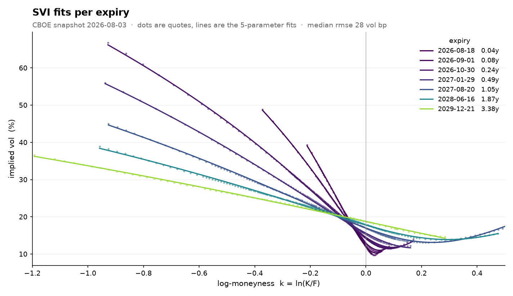
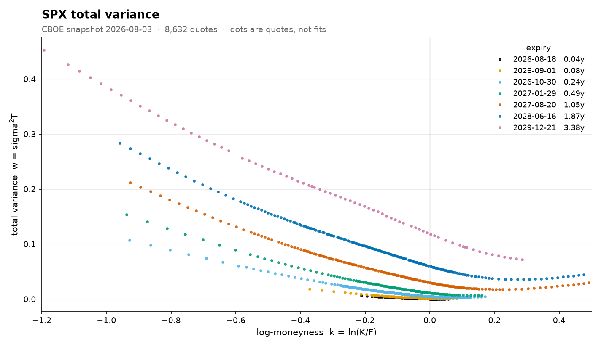
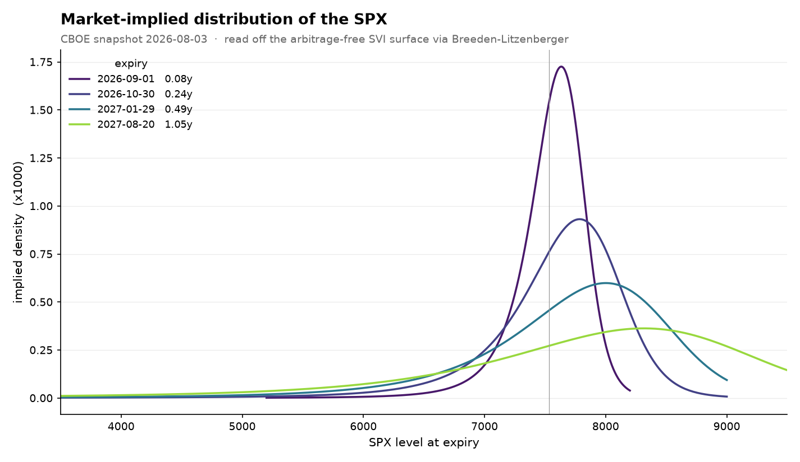

# SVI Volatility Surface

An arbitrage-free implied volatility surface for SPX options, built from one
raw CBOE option chain: load, clean, recover forwards from put-call parity,
invert Black-76 for implied vols, calibrate an SVI smile per expiry, enforce
butterfly and calendar no-arbitrage, and read the market-implied probability
distribution off the result.



Dots are cleaned quotes, lines are the 5-parameter SVI fits. Median error is
28 vol basis points, inside the bid-ask spreads the quotes came from.

## Pipeline

| stage | file | 
|---|---|
| load the chain | `src/svi/chain.py` |
| filter bad quotes | `src/svi/filter.py` |
| forwards and discounts from parity | `src/svi/forwards.py` |
| implied vols (Black-76 + brentq) | `src/svi/black76.py` |
| plots of the raw smiles | `src/svi/plots.py` |
| SVI fit per expiry | `src/svi/model.py`, `src/svi/fit.py` |
| no-arbitrage checks and repair | `src/svi/surface.py` |
| implied densities | `src/svi/density.py` |

## Data

Snapshots come from the CBOE delayed quotes page (Quote Table download with
Expiration Type and Strike Range set to "All"). Full downloads live in
`data/raw/`, which is gitignored. One snapshot is committed in `data/sample/`
so everything runs without a CBOE account: SPX on 2026-08-03, header spot
7489.72, 26,088 quotes after separating the SPX and SPXW roots (same expiry
dates, different contracts, so I keep the dominant root per expiry by open
interest).

One quirk of this snapshot: it was taken pre-market, so the spot in the
header is stale. It does not matter downstream, because the forwards
recovered from parity come from live option quotes only.

## Running it

```
python -m venv .venv
.venv\Scripts\activate            # Windows
pip install pandas numpy scipy matplotlib

python src/svi/filter.py   data/sample/spx_quotedata_20260803.csv
python src/svi/forwards.py data/sample/spx_quotedata_20260803.csv
python src/svi/black76.py  data/sample/spx_quotedata_20260803.csv
python src/svi/plots.py    data/sample/spx_quotedata_20260803.csv
python src/svi/fit.py      data/sample/spx_quotedata_20260803.csv
python src/svi/surface.py  data/sample/spx_quotedata_20260803.csv
python src/svi/density.py  data/sample/spx_quotedata_20260803.csv
```

Each script re-runs the pipeline up to its own stage, so the later ones take
a minute or two. Figures land in `figures/`, the final parameter set in
`figures/svi_params.csv`.

## Results

### Cleaning

Quotes are flagged with a reason instead of deleted, so the filters produce
a log of what was removed and why, and later stages can still read the full
chain when they need it (the parity regression uses ITM legs the vol side
throws away).

```
               removed   pct
in-the-money     11508  44.1
maturity < 7d     3072  11.8
convexity         1641   6.3
spread > 25%       839   3.2
zero bid           393   1.5
monotonicity         3   0.0
KEPT              8632  33.1
```

Most of the removal is by design: ITM quotes go because the OTM option at
the same strike carries the same information with a cleaner price, and
everything under 7 days goes because there is too little variance left to
measure. The genuine data-quality findings are the 6.3% violating convexity
and the 1.5% with no bid. After filtering: 49 usable expiries, median 146
quotes per expiry.

### Forwards and discounts

C - P = D(F - K) holds across the strikes of an expiry with one D and one F,
so one OLS fit per expiry recovers both: slope = -D, intercept = DF. No rate
or dividend model needed. Only strikes where both legs are alive get to vote.

Across 49 expiries D falls smoothly from 0.999 at one week to 0.73 at five
years, and the implied rate sits at 4.0-4.8%, a sensible money-market curve.
The one-week forward comes out at 7531.5 against the stale header spot of
7489.7, so the regression also tells you where the index actually stood at
snapshot time.

### Implied vols

Black-76 needs (F, K, T, D, sigma) and the first four are known, so each mid
pins down its sigma; the map from sigma to price is strictly increasing, so
brentq on [1e-4, 5] finds the unique root. All 8,632 surviving quotes
inverted with zero failures. As a check, inverting the call and the put at
the same near-the-money strike gives vols agreeing to about 0.3 basis
points, which is parity closing and confirms F and D are right.

### SVI calibration

Each expiry's (k, w) points get the 5-parameter raw SVI
w(k) = a + b(rho(k-m) + sqrt((k-m)^2 + s^2)). With the elbow (m, s) frozen
the model is linear in the rest, so the fit is a closed-form weighted least
squares inside a 2-dimensional search, with quotes weighted 1/w so the
objective is (approximately) equal-weight in vol.

Getting this stable took three failed attempts, each a known degeneracy:
the elbow parked outside the data with b exploding, an oversized-s parabola
that ignores the wings, and my own mistake of imposing a >= 0 when the
theory only requires the curve's minimum to be >= 0. The constraints that
survive in the code are the correct ones: w_min >= 0, |rho| < 1, Roger
Lee's wing bound b(1+|rho|) <= 4/T, the elbow boxed inside the observed
strikes, and rho <= 0 as an explicit equity prior.

Median fit error is 28 vol bp across 48 maturities (one expiry with 14
quotes is excluded). The honest finding: with strikes only out to |k| of
about 1, the five parameters are individually only partially identified.
Several parameter sets draw nearly the same curve over the quoted range and
differ only in wings the market never priced. The curve is the identified
object; the wings are priors, and I say so rather than pretend otherwise.

### Arbitrage-free



Two conditions. Butterfly, within a smile: Gatheral's g(k), proportional to
the implied density, must stay >= 0. All 48 fitted smiles pass with no
intervention. Calendar, across smiles: total variance must not fall as T
grows at any k. Seven adjacent pairs violate, every single one at the far
edge of the quoted strike range, exactly where the identifiability finding
says the curves are guesswork, and mostly between weekly expiries only days
apart. The repair is minimal: walk maturities in ascending order and lift
the level parameter of a violating smile by exactly its worst shortfall.
Eleven smiles move, the worst by 67 vol bp at the money, and the surface
comes out clean: 0 butterfly and 0 calendar violations. The repaired
parameter set is written to `figures/svi_params.csv`.

### Implied densities



Breeden-Litzenberger: differentiate call prices twice in strike and you get
the risk-neutral density of the index at expiry. For SVI that density is
built from the same g(k) used in the butterfly check, so the arbitrage
condition and "probabilities are non-negative" are literally one statement.

The picture shows the fat left tail (the skew translated into probability),
the mode sitting above the forward because the risk-neutral mean must equal
F while the tail drags it down, and uncertainty spreading with horizon.
Integrating each density over just the quoted range gives 0.97-1.00 of
total mass without anything forcing it to, which is a quiet consistency
check on the whole pipeline. These are risk-neutral densities, so they
embed risk premia and are not pure forecasts.

## Conclusion

One CSV in, about 240 numbers out: figures/svi_params.csv holds five
parameters for each of 48 maturities, mutually consistent, individually
density-positive, able to price any strike at any of those dates without
offering free money. The densities read off the result are the same
information as the smiles, translated from vol into probability.

Three things I take away from building it. First, most of "cleaning" is
not about bad data: two thirds of what I removed was deliberate selection
(the ITM half...), and the genuine quality findings were a
few percent of stale or dead quotes. Second, the option chain is its own
reference frame: put-call parity handed me the forwards, the discounts
and even the true index level while the header spot was stale, with no
rate or dividend model anywhere. Third, least squares identifies the curve, 
not the parameters. With strikes only out to |k| of about 1, several parameter 
sets draw the same smile over the quoted range and differ only in wings 
the market never priced, so the wings rest on priors I state instead of estimates 
I pretend to have. Fittingly, the only arbitrage violations appeared
exactly where that identification dies, at the edge of the data, and the
cost of repairing them is on record in vol basis points.