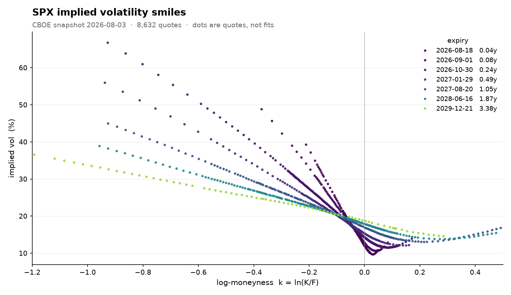

# SVI Volatility Surface

Work in progress. The goal is to build an arbitrage-free implied volatility
surface for SPX options: load a raw CBOE option chain, clean it, recover
forwards and discount factors from put-call parity, invert Black-76 for
implied vols, then fit an SVI smile per expiry and constrain the fits so the
surface is free of butterfly and calendar arbitrage.

Everything up to the implied vols is done. The SVI fitting is next.



Each dot is one cleaned quote, not a fit. The downward slope is the equity
skew (OTM puts trade at higher vols than OTM calls), short maturities are
steep and long ones flatten out, and the 1-2y curves turn back up on the call
wing, so it really is a smile and not just a skew.

## Pipeline

| stage | file | state |
|---|---|---|
| load the chain | `src/svi/chain.py` | done |
| filter bad quotes | `src/svi/filter.py` | done |
| forwards and discounts from parity | `src/svi/forwards.py` | done |
| implied vols (Black-76 + brentq) | `src/svi/black76.py` | done |
| first plots of the data | `src/svi/plots.py` | done |
| SVI fit per expiry | `src/svi/fit.py`, `src/svi/model.py` | next |
| no-arbitrage constraints | `src/svi/surface.py` | pending |

## Data

Snapshots come from the CBOE delayed quotes page (Quote Table download with
Expiration Type and Strike Range set to "All"). Full downloads live in
`data/raw/`, which is gitignored. One snapshot is committed in `data/sample/`
so everything can be run without a CBOE account: SPX on 2026-08-03, header
spot 7489.72, 26,088 quotes after separating the SPX and SPXW roots (both
trade on the same expiry dates but are different contracts, so I keep the
dominant root per expiry by open interest).

One quirk of this snapshot: it was taken pre-market, so the spot printed in
the header is stale. It does not matter downstream, because the forward
recovered from parity comes from live option quotes only.

## Running it

```
python -m venv .venv
.venv\Scripts\activate            # Windows
pip install pandas numpy scipy matplotlib

python src/svi/filter.py   data/sample/spx_quotedata_20260803.csv
python src/svi/forwards.py data/sample/spx_quotedata_20260803.csv
python src/svi/black76.py  data/sample/spx_quotedata_20260803.csv
python src/svi/plots.py    data/sample/spx_quotedata_20260803.csv
```

## Results so far

### Cleaning

Quotes are flagged with a reason instead of deleted, so the filters produce a
log of what was removed and why, and later stages can still read the full
chain when they need it (the parity regression uses ITM legs the vol side
throws away).

```
               removed   pct
in-the-money     11508  44.1
maturity < 7d     3072  11.8
convexity         1641   6.3
spread > 25%       839   3.2
zero bid           393   1.5
monotonicity         3   0.0
KEPT              8632  33.1
```

Most of the removal is by design, not data quality: ITM quotes go because the
OTM option at the same strike carries the same information with a cleaner
price, and everything under 7 days to expiry goes because there is too little
variance left to measure. The genuine data-quality findings are the 6.3% of
quotes violating convexity (mostly stale prices at illiquid strikes) and the
1.5% with no bid. After filtering: 49 usable expiries, median 146 quotes per
expiry, minimum 14.

### Forwards and discounts

C - P = D(F - K) holds across the strikes of an expiry with one D and one F,
so one OLS fit per expiry (y = C - P against K) recovers both: slope = -D,
intercept = DF. No rate or dividend model needed. Only strikes where both
legs are alive get to vote (bid > 0 and spread <= 25% on each side).

Across 49 expiries D falls smoothly from 0.999 at one week to 0.73 at five
years, and the implied continuously compounded rate sits at 4.0-4.8%, which
is a sensible money-market curve. The one-week forward comes out at 7531.5
against the stale header spot of 7489.7, so the regression also tells you
where the index actually stood at the snapshot time. The longest expiry
(Dec 2031) only has 18 live pairs and its forward breaks the smooth term
structure, so I treat it with caution.

### Implied vols

Black-76 needs (F, K, T, D, sigma) and the first four are known, so each mid
pins down its sigma. The map from sigma to price is strictly increasing,
which makes the root unique and easy to bracket (brentq on [1e-4, 5]).

All 8,632 surviving quotes inverted with zero failed roots. Median vol 18.5%,
5th-95th percentile 11.1%-41.1%. As a check, inverting the call and the put
at the same near-the-money strike gives vols that agree to about 0.3 basis
points, which is parity closing and confirms F and D are right.


Same data as total variance w = sigma^2 T, the plane SVI is fitted in. The
curves stack by maturity and do not cross, which is the no-calendar-arbitrage
condition the surface will have to keep.

## Next

Fit the 5-parameter SVI smile to each expiry's (k, w) points, then impose the
butterfly and calendar constraints so the whole surface is arbitrage-free.